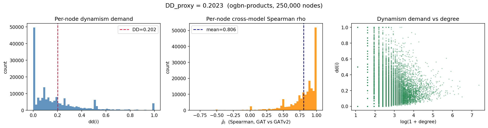
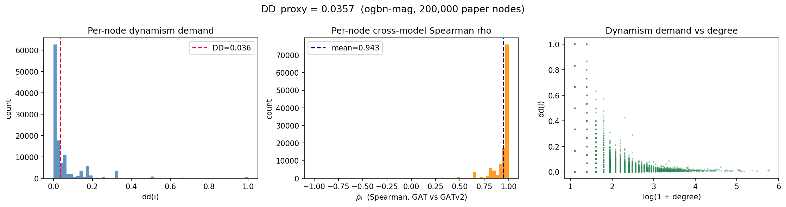
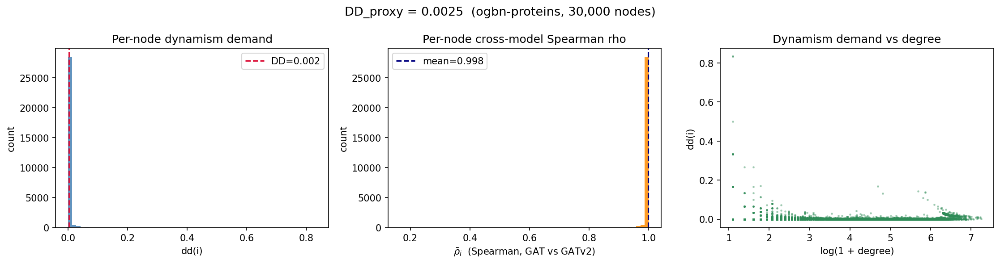

# RQ1 — Dynamism Demand: Formulation and Computation

**Research Question:** How much does the graph structure *demand* dynamic attention — i.e., do GAT and GATv2 route information differently, and can that divergence be quantified as a graph-level scalar?

This document covers the **DD_proxy formulation** and its **end-to-end computation pipeline** on three OGB node property prediction benchmarks: **ogbn-products**, **ogbn-mag**, and **ogbn-proteins**.  
For the raw attention-comparison metrics (cosine, JSD, Spearman) that motivate this formulation, see [RQ1_AttentionComparison.md](RQ1_AttentionComparison.md).  
For the full mathematical specification (including DD_true and the 2×2 interpretation table), see [DD_formula.md](DD_formula.md).

---

## Helper Notebook

- [Computation Helper Notebook (Google Colab)](https://colab.research.google.com/drive/1qoLPJ0kIVT5IlzDMrU_VXJAgPuZIBmSE?usp=sharing)

---

## Pipeline Overview

```text
ogbn-arxiv  ──►  best_gat_arxiv.pt
                 best_gatv2_arxiv.pt
                        │
           ┌────────────┼────────────┐
           ▼            ▼            ▼
    ogbn-products   ogbn-mag    ogbn-proteins
    compute_dd.py  compute_     compute_dd_
    (250k nodes,   dd_mag.py    proteins.py
     zero-pad      (200k paper  (30k nodes,
     100→128-dim)  nodes,       edge_attr→
                   128-dim,     pseudo-feats,
                   no padding)  zero-pad 8→128)
           │            │            │
           ▼            ▼            ▼
      dd_products    dd_mag.pt   dd_proteins
         .pt            +           .pt
          +          dd_mag.png      +
      dd_products              dd_proteins
         .png                     .png
           │            │            │
           └────────────┼────────────┘
                        ▼
                  summarize_dd.py
                  (run per dataset)
                        │
           ┌────────────┴────────────┐
     dd_summary.txt           dd_nodes.csv
    (human-readable          (per-node table:
     statistical report)      node_id, degree,
                               rho_bar, dd)
```

### Step-by-step

1. **Train** both models on **ogbn-arxiv** (`train.py --model gat` and `--model gatv2`).  
   The best checkpoint (by validation accuracy) is saved to `checkpoints/`.

2. **Compute DD_proxy** on each evaluation graph using the corresponding script.  
   Both frozen models are run on the same induced subgraph (fixed seed=42). Per-node Spearman correlations are accumulated across layers and heads, then aggregated into a single graph-level scalar. Results are saved as a `.pt` tensor bundle and a diagnostic PNG.

   | Script | Target | Nodes sampled | Feature handling |
   |--------|--------|---------------|-----------------|
   | `compute_dd.py` | ogbn-products | 250 000 | 100-dim → zero-padded to 128 |
   | `compute_dd_mag.py` | ogbn-mag (paper-cites-paper) | 200 000 | 128-dim — no padding needed |
   | `compute_dd_proteins.py` | ogbn-proteins | 30 000 | 8-dim edge_attr agg → zero-padded to 128 |

3. **Summarise** (`summarize_dd.py`).  
   Parses each `.pt` output and writes a structured text report (`dd_summary.txt`) and a per-node CSV (`dd_nodes.csv`).

---

## Formula — DD_proxy(G)

The full derivation is in [DD_formula.md](DD_formula.md). The key steps:

**Step 1 — Per-node, per-layer, per-head Spearman correlation**

For each node $i$, layer $l$, and head $h$, validity requires $\deg_l(i) \geq 3$, checked per layer using the attention edge index (which includes the self-loop added by GATConv). `min_deg=3` therefore corresponds to $\geq 2$ real neighbours. Rank correlations over fewer than three positions are statistically brittle.

$$\rho_i^{(l,h)} = \begin{cases} \text{Spearman}\!\left(\alpha_{\text{GAT}}^{(l,h)}[N_l(i)],\; \alpha_{\text{GATv2}}^{(l,h)}[N_l(i)]\right) & \text{if } \deg_l(i) \geq 3 \\ \text{undefined} & \text{otherwise} \end{cases}$$

**Step 2 — Uniform mean over valid (layer, head) pairs**

Let $\mathcal{V}_i = \{(l,h) : \deg_l(i) \geq 3\}$ be the valid pairs for node $i$.

$$\bar{\rho}_i = \frac{\displaystyle\sum_{(l,h)\,\in\,\mathcal{V}_i} \rho_i^{(l,h)}}{|\mathcal{V}_i|}$$

For the 2-layer model when all pairs are valid ($|\mathcal{V}_i| = 3$, $H_0 = 2$, $H_1 = 1$):

$$\bar{\rho}_i = \frac{\rho_i^{(0,1)} + \rho_i^{(0,2)} + \rho_i^{(1,1)}}{3}$$

If a node has $\deg_l(i) < 3$ at exactly one layer, the average covers only the remaining valid pairs — the denominator is $|\mathcal{V}_i|$, not total heads.

**Step 3 — Per-node dynamism demand**

$$\text{dd}(i) = 1 - \max\!\left(0,\; \bar{\rho}_i\right) \;\in\; [0, 1]$$

Anticorrelated rankings ($\bar\rho_i < 0$) are clamped to the same demand level as zero correlation.

**Step 4 — Graph-level DD (degree-weighted mean)**

$$\boxed{DD_{\text{proxy}}(G) = \frac{\displaystyle\sum_{\substack{i \in V \\ \mathcal{V}_i\,\neq\,\emptyset}} \deg(i)\cdot \text{dd}(i)}{\displaystyle\sum_{\substack{i \in V \\ \mathcal{V}_i\,\neq\,\emptyset}} \deg(i)}}$$

where $\deg(i)$ is the **full-graph degree** (no self-loops added by GATConv). High-degree nodes receive greater weight because they have more reliable Spearman estimates and greater influence on message passing. Using the full-graph degree ensures hub nodes retain their structural weight even when sampled sparsely in any given layer.

---

## Dataset

### Training — ogbn-arxiv

| Property | Value |
|----------|-------|
| Task | Node classification (40 arXiv subject categories) |
| Nodes | ~169 000 papers |
| Edges | ~1.16 M (made undirected for training) |
| Node features | 128-dim Node2Vec embeddings |
| Source | [Open Graph Benchmark](https://ogb.stanford.edu/docs/nodeprop/#ogbn-arxiv) |

### Evaluation — ogbn-products

| Property | Value |
|----------|-------|
| Task | Node classification (Amazon co-purchase graph; labels unused here) |
| Nodes | ~2.45 M products |
| Edges | ~61.9 M (made undirected) |
| Node features | 100-dim bag-of-words → **zero-padded to 128** for frozen model compatibility |
| Subgraph | 250 000 randomly sampled nodes (induced, seed=42) |
| Induced edges | ~2 578 744 (undirected, before self-loops) |
| Source | [Open Graph Benchmark](https://ogb.stanford.edu/docs/nodeprop/#ogbn-products) |

Using ogbn-products as the evaluation graph tests whether the DD_proxy signal is informative on a structurally different graph (co-purchase network vs. citation network). Features are zero-padded rather than reprojected, keeping the frozen weights valid and making the comparison purely structural.

### Evaluation — ogbn-mag (paper-cites-paper)

| Property | Value |
|----------|-------|
| Task | Node classification (academic knowledge graph; labels unused here) |
| Graph type | Heterogeneous (paper, author, institution, field_of_study); **only paper-cites-paper used** |
| Paper nodes | 736 389 |
| Directed citation edges | 5 416 271 → made undirected after subgraph sampling |
| Node features | 128-dim (matches checkpoint in_channels exactly — **no zero-padding required**) |
| Subgraph | 200 000 randomly sampled paper nodes (induced, seed=42) |
| Induced edges | ~796 166 (undirected, before self-loops) |
| Source | [Open Graph Benchmark](https://ogb.stanford.edu/docs/nodeprop/#ogbn-mag) |

ogbn-mag is a heterogeneous graph; only the paper-cites-paper relation is used. This homogeneous citation subgraph structurally resembles ogbn-arxiv (the training graph) but is ~4× larger and covers a broader range of academic disciplines. The 128-dim paper features match the frozen checkpoint's `in_channels=128` exactly — no padding is applied, making this the cleanest feature-transfer setting among the three evaluation graphs.

### Evaluation — ogbn-proteins

| Property | Value |
|----------|-------|
| Task | Node-level binary classification across 112 protein functions (labels unused here) |
| Nodes | 132 534 proteins |
| Edges | ~39.6 M protein-protein interaction edges (undirected) |
| Node features | **None** — 8-dim edge attributes are mean-aggregated per target node, then **zero-padded to 128** |
| Mean degree | ~598 neighbours per protein (full graph) |
| Subgraph | 30 000 randomly sampled nodes (induced, seed=42) |
| Induced edges | ~4 082 120 (undirected, before self-loops) |
| Source | [Open Graph Benchmark](https://ogb.stanford.edu/docs/nodeprop/#ogbn-proteins) |

ogbn-proteins has no native node features. Pseudo-node features are constructed by mean-aggregating the 8-dim edge attributes over all incoming edges per node, then zero-padding to 128-dim so the frozen checkpoint's `in_channels` constraint is satisfied. The extremely high mean degree (~598 in the full graph, ~272 in the 30k induced subgraph) means nearly all nodes pass the `min_deg=3` validity filter (97.2% valid). The 30k subgraph size is a VRAM constraint: the induced ~4.1M edges push GATv2Conv to its peak memory limit on a 15.6 GB T4.

---

## Model Configuration

Both models are the same checkpoints trained for RQ1 (see [RQ1_AttentionComparison.md](RQ1_AttentionComparison.md)).

| Hyperparameter | Value |
|----------------|-------|
| Layers | 2 |
| Hidden channels | 64 |
| Attention heads | 2 (layer 0), 1 (layer 1) |
| Dropout | 0.0 (eval mode) |
| GAT val accuracy | 0.6822 (ogbn-arxiv) |
| GATv2 val accuracy | 0.6868 (ogbn-arxiv) |

The two models differ by < 0.005 in validation accuracy — a prerequisite for a fair DD_proxy comparison, since a model that has not converged may diverge from the other for reasons unrelated to expressiveness.

---

## Implementation Notes

### ogbn-products: `compute_dd.py`

#### Single forward pass

Both models are run **in a single call** on the same subgraph object. This is critical: `compare_attention.py` (RQ1) runs per-layer separately and can produce misaligned node orderings if the subgraph changes between calls. `compute_dd.py` avoids this entirely.

#### Spearman via Pearson-on-ranks

Spearman correlation is computed as Pearson correlation of integer ranks, fully vectorised on GPU:

```
_rank_within_group   — argsort-based 0-indexed rank per source-node group  [E]
_pearson_within_group — Pearson(ra, rb) per group using scatter reductions  [N]
per_node_spearman    — loops over heads, stacks, averages                   [N]
```

This avoids Python loops over nodes and keeps the entire computation on-device until the final `cpu()` transfer.

#### Per-layer validity and accumulation

Validity is checked per-layer from the attention edge index (which includes GATConv self-loops). Each `(layer, head)` pair is accumulated independently, so the denominator of $\bar\rho_i$ is the per-node count $|\mathcal{V}_i|$, not the global total of heads:

```python
deg_l   = scatter(ones, src_l, dim_size=N, reduce='sum')   # attention degree incl. self-loop
valid_l = (deg_l >= min_deg)

for h in range(H_l):
    rho_lh = pearson_on_ranks(alpha_gat[:,h], alpha_gatv2[:,h], src_l)
    valid_rho_sum    += where(valid_l, rho_lh, zeros)
    valid_pair_count += valid_l.float()

rho_bar = valid_rho_sum / valid_pair_count   # NaN where V_i = ∅
```

Nodes for which no layer has sufficient degree (`valid_pair_count == 0`) are marked `NaN` and excluded from the degree-weighted mean.

#### Zero-padding

ogbn-products provides 100-dim features. The loader detects `x.size(1) < 128` and appends zeros:

```python
x = torch.cat([x, torch.zeros(x.size(0), 128 - x.size(1))], dim=1)
```

Both models see identical padded features, so the relative comparison remains valid.

### ogbn-mag: `compute_dd_mag.py`

#### Heterogeneous graph handling

ogbn-mag is loaded via the plain OGB `NodePropPredDataset` dict API to avoid `HeteroData` parsing issues across PyG versions. Only the `paper` node features and the `(paper, cites, paper)` edge index are extracted; all other node and edge types (author, institution, field_of_study, writes, affiliated_with, has_topic) are discarded.

#### Separate forward passes with CPU offload

`compute_dd_mag.py` runs GAT and GATv2 in **separate sequential forward passes**, offloading each model's attention tensors to CPU before the next forward pass:

```python
_, _gat_attn_gpu = gat_model(x, edge_index)
gat_attn = [(ei.cpu(), alpha.cpu()) for ei, alpha in _gat_attn_gpu]
del _gat_attn_gpu; torch.cuda.empty_cache()

_, _gatv2_attn_gpu = gatv2_model(x, edge_index)
gatv2_attn = [(ei.cpu(), alpha.cpu()) for ei, alpha in _gatv2_attn_gpu]
```

This keeps peak VRAM to one model's footprint, required because the 796k-edge induced subgraph would exhaust T4 memory if both models' attention tensors were held simultaneously.

#### No feature padding

ogbn-mag paper nodes have 128-dim features that exactly match the frozen checkpoint's `in_channels=128`. No zero-padding is applied.

### ogbn-proteins: `compute_dd_proteins.py`

#### Edge-attribute feature construction

ogbn-proteins has no native node features. The 8-dim edge attributes are mean-aggregated over all incoming edges per target node to produce pseudo-node features, then zero-padded to 128-dim:

```python
x = scatter(data.edge_attr, data.edge_index[1], dim=0,
            dim_size=num_nodes, reduce='mean')   # [N, 8]
x = F.pad(x, (0, 128 - x.size(1)))              # [N, 128]
```

The padding zeros occupy 120 of the 128 dimensions; both models operate on the same low-rank input signal, which contributes to the near-identical attention distributions observed.

#### Dense graph and subgraph size constraint

ogbn-proteins is extremely dense (~598 mean degree in the full graph). For a 30k-node induced subgraph with ~4.1M edges, GATv2Conv materialises `[E, heads × out_ch]` tensors per layer (`x_i` and `x_j` concatenated), peaking at ~4.2 GB per model on a T4. Increasing to 50k nodes would produce ~11.3M edges and exceed 24 GB VRAM. The 30k default is the safe upper bound for the 15.6 GB T4 used here.

#### No reverse-edge augmentation

Unlike ogbn-products and ogbn-mag (both directed), ogbn-proteins is already undirected — the OGB PyG loader provides edges in both directions. No reverse-edge augmentation is applied.

---

## File Reference

### Input files

| File | Role |
|------|------|
| `models.py` | GAT and GATv2 model definitions (returns attention weights per layer) |
| `checkpoints/best_gat_arxiv.pt` | Frozen GAT checkpoint trained on ogbn-arxiv |
| `checkpoints/best_gatv2_arxiv.pt` | Frozen GATv2 checkpoint trained on ogbn-arxiv |
| `compute_dd.py` | DD_proxy computation for ogbn-products |
| `compute_dd_mag.py` | DD_proxy computation for ogbn-mag (paper-cites-paper) |
| `compute_dd_proteins.py` | DD_proxy computation for ogbn-proteins |
| `summarize_dd.py` | Parses `.pt` output; writes `dd_summary.txt` and `dd_nodes.csv` |
| `DD_formula.md` | Full mathematical specification of DD_proxy and DD_true |

### Files generated

| File | Description |
|------|-------------|
| `ogbn-products/dd_results/dd_products.pt` | Tensor bundle: `DD_proxy`, `dd_per_node` [N], `rho_bar` [N], `deg` [N], metadata |
| `ogbn-products/dd_results/dd_products.png` | 3-panel diagnostic: dd histogram, rho_bar histogram, dd vs log-degree scatter |
| `ogbn-products/dd_results/dd_summary.txt` | Human-readable statistical report (degree-stratified, hub spotlight) |
| `ogbn-products/dd_results/dd_nodes.csv` | Per-node table: `node_id`, `degree`, `rho_bar`, `dd` |
| `ogbn-products/compute_dd.log` | Runtime log: device, checkpoint accuracy, per-layer rho stats, final scalar |
| `ogbn-mag/dd_results/dd_mag.pt` | Tensor bundle for ogbn-mag |
| `ogbn-mag/dd_results/dd_mag.png` | 3-panel diagnostic for ogbn-mag |
| `ogbn-mag/dd_results/dd_summary.txt` | Statistical report for ogbn-mag |
| `ogbn-mag/dd_results/dd_nodes.csv` | Per-node table for ogbn-mag |
| `ogbn-mag/compute_dd_mag.log` | Runtime log for ogbn-mag |
| `ogbn-proteins/dd_results/dd_proteins.pt` | Tensor bundle for ogbn-proteins |
| `ogbn-proteins/dd_results/dd_proteins.png` | 3-panel diagnostic for ogbn-proteins |
| `ogbn-proteins/dd_results/dd_summary.txt` | Statistical report for ogbn-proteins |
| `ogbn-proteins/dd_results/dd_nodes.csv` | Per-node table for ogbn-proteins |
| `ogbn-proteins/compute_dd_proteins.log` | Runtime log for ogbn-proteins |

---

## Results

### ogbn-products

#### Per-layer Spearman statistics (from `ogbn-products/compute_dd.log`)

Both models were evaluated on a Tesla T4 (15.6 GB VRAM).

| Layer | Heads | Mean ρ | Median ρ | Std ρ |
|-------|-------|--------|----------|-------|
| 0 | 2 | 0.7801 | 0.8619 | 0.2798 |
| 1 | 1 | 0.8575 | 0.9670 | 0.2809 |

Layer 1 shows **higher and more concentrated agreement** than layer 0 — consistent with the RQ1 finding that architectural differences matter most early in the network where both models operate on the same raw features.

#### Graph-level DD_proxy

| Metric | Value |
|--------|-------|
| Valid nodes ($\mathcal{V}_i \neq \emptyset$) | 190 931 (76.4% of 250 000 sampled) |
| $\bar\rho$ mean | 0.8059 |
| $\bar\rho$ median | 0.8791 |
| **DD_proxy(G)** | **0.2023** |
| Demand level | **low (< 0.33)** |

#### DD(i) distribution

| Statistic | dd(i) | rho_bar |
|-----------|-------|---------|
| Mean | 0.1917 | 0.8059 |
| Std | 0.2211 | 0.2318 |
| Min | 0.0000 | −0.8214 |
| p5 | 0.0000 | 0.3667 |
| p25 | 0.0000 | 0.7333 |
| Median | 0.1209 | 0.8791 |
| p75 | 0.2667 | 1.0000 |
| p95 | 0.6333 | 1.0000 |
| Max | 1.0000 | 1.0000 |

#### Demand level breakdown

| Level | Range | Fraction | Nodes |
|-------|-------|----------|-------|
| Low | dd < 0.33 | 80.78% | 154 228 |
| Moderate | 0.33 ≤ dd < 0.66 | 14.51% | 27 712 |
| High | dd ≥ 0.66 | 4.71% | 8 991 |

#### Degree-stratified DD_proxy

Degree here is **full-graph degree** (no self-loops). The 39 471 valid nodes not shown below (190 931 − 151 460) have full-graph degree 1–2 but passed the per-layer attention-degree filter (attention degree ≥ 3 when the self-loop is counted); they are valid contributors to DD_proxy but fall below the lowest band.

| Degree band | Nodes | Mean dd | Median dd | Mean degree |
|-------------|-------|---------|-----------|-------------|
| low (3–5) | 27 234 | 0.2105 | 0.1000 | 4.0 |
| medium (6–20) | 91 623 | 0.2112 | 0.1545 | 11.1 |
| high (21–100) | 31 119 | 0.1942 | 0.1594 | 35.7 |
| hub (> 100) | 1 484 | 0.2236 | 0.2051 | 177.2 |

DD is **uniformly low across all degree bands**. Hub nodes (> 100 neighbours) have the highest mean dd (0.2236), but this is still firmly in the low regime.

#### Top-10 highest-degree hubs

| node_id | degree | rho_bar | dd(i) |
|---------|--------|---------|-------|
| 95 238 | 1 576 | 0.7314 | 0.2686 |
| 81 208 | 1 134 | 0.8153 | 0.1847 |
| 138 427 | 1 018 | 0.7817 | 0.2183 |
| 132 134 | 1 014 | 0.8066 | 0.1934 |
| 69 549 | 950 | 0.8755 | 0.1245 |
| 26 128 | 904 | 0.8075 | 0.1925 |
| 52 710 | 860 | 0.7876 | 0.2124 |
| 90 786 | 838 | 0.7976 | 0.2024 |
| 27 453 | 804 | 0.8788 | 0.1212 |
| 180 296 | 790 | 0.6969 | 0.3031 |

Degrees are full-graph degrees (no self-loops). Even the most heavily connected node (degree 1 576) has $dd = 0.27$ — GAT and GATv2 agree on its neighbour rankings at $\bar\rho = 0.73$. No hub falls into the high-demand regime.

---

### ogbn-mag

#### Per-layer Spearman statistics (from `ogbn-mag/compute_dd_mag.log`)

Both models were evaluated on a Tesla T4 (15.6 GB VRAM). The paper-cites-paper subgraph has 796 166 undirected edges over 200 000 sampled paper nodes.

| Layer | Heads | Mean ρ | Median ρ | Std ρ |
|-------|-------|--------|----------|-------|
| 0 | 2 | 0.9371 | 0.9860 | 0.1384 |
| 1 | 1 | 0.9535 | 1.0000 | 0.1452 |

Both layers show substantially higher agreement than ogbn-products. Layer 1 median reaches 1.000 — more than half of valid nodes achieve perfect rank correlation at the output layer.

#### Graph-level DD_proxy

| Metric | Value |
|--------|-------|
| Valid nodes ($\mathcal{V}_i \neq \emptyset$) | 121 637 (60.8% of 200 000 sampled) |
| $\bar\rho$ mean | 0.9426 |
| $\bar\rho$ median | 0.9841 |
| **DD_proxy(G)** | **0.0357** |
| Demand level | **low (< 0.33)** |

The lower valid-node fraction (60.8% vs. 76.4% for ogbn-products) reflects the sparser citation graph: many paper nodes cite only one or two others in the sampled subgraph, falling below the `min_deg=3` threshold.

#### DD(i) distribution

| Statistic | dd(i) | rho_bar |
|-----------|-------|---------|
| Mean | 0.0566 | 0.9426 |
| Std | 0.1134 | 0.1213 |
| Min | 0.0000 | −1.0000 |
| p5 | 0.0000 | 0.7333 |
| p25 | 0.0000 | 0.9333 |
| Median | 0.0159 | 0.9841 |
| p75 | 0.0667 | 1.0000 |
| p95 | 0.2667 | 1.0000 |
| Max | 1.0000 | 1.0000 |

#### Demand level breakdown

| Level | Range | Fraction | Nodes |
|-------|-------|----------|-------|
| Low | dd < 0.33 | 95.23% | 115 836 |
| Moderate | 0.33 ≤ dd < 0.66 | 3.95% | 4 805 |
| High | dd ≥ 0.66 | 0.82% | 996 |

#### Degree-stratified DD_proxy

| Degree band | Nodes | Mean dd | Median dd | Mean degree |
|-------------|-------|---------|-----------|-------------|
| low (3–5) | 48 820 | 0.0567 | 0.0333 | 3.8 |
| medium (6–20) | 38 168 | 0.0266 | 0.0183 | 9.6 |
| high (21–100) | 4 026 | 0.0135 | 0.0117 | 31.4 |
| hub (> 100) | 87 | 0.0105 | 0.0098 | 170.4 |

DD decreases **monotonically with degree** — the inverse of the ogbn-products pattern. Hub papers in academic citation networks have the most stable neighbourhoods, with both attention functions converging on essentially identical rankings.

#### Top-10 highest-degree hubs

| node_id | degree | rho_bar | dd(i) |
|---------|--------|---------|-------|
| 39 949 | 607 | 0.9902 | 0.0098 |
| 5 837 | 604 | 0.9914 | 0.0086 |
| 109 501 | 469 | 0.9891 | 0.0109 |
| 61 351 | 369 | 0.9919 | 0.0081 |
| 119 316 | 321 | 0.9843 | 0.0157 |
| 12 732 | 312 | 0.9891 | 0.0109 |
| 103 130 | 310 | 0.9933 | 0.0067 |
| 47 224 | 266 | 0.9937 | 0.0063 |
| 85 507 | 260 | 0.9866 | 0.0134 |
| 48 272 | 249 | 0.9762 | 0.0238 |

Degrees are full-graph degrees (no self-loops). Even the most-cited paper in the sample (degree 607) has $dd = 0.0098$ — near-perfect agreement at $\bar\rho = 0.9902$.

---

### ogbn-proteins

#### Per-layer Spearman statistics (from `ogbn-proteins/compute_dd_proteins.log`)

Both models were evaluated on a Tesla T4 (15.6 GB VRAM). The 30k-node induced subgraph has 4 082 120 undirected edges — an average of ~272 neighbours per sampled node.

| Layer | Heads | Mean ρ | Median ρ | Std ρ |
|-------|-------|--------|----------|-------|
| 0 | 2 | 0.9986 | 0.9997 | 0.0133 |
| 1 | 1 | 0.9976 | 0.9993 | 0.0125 |

Both layers are at near-perfect agreement. The standard deviation of ρ is below 0.015 at every layer — the distributions are effectively degenerate at 1.0.

#### Graph-level DD_proxy

| Metric | Value |
|--------|-------|
| Valid nodes ($\mathcal{V}_i \neq \emptyset$) | 29 160 (97.2% of 30 000 sampled) |
| $\bar\rho$ mean | 0.9983 |
| $\bar\rho$ median | 0.9995 |
| **DD_proxy(G)** | **0.0025** |
| Demand level | **low (< 0.33)** — effectively near-zero |

#### DD(i) distribution

| Statistic | dd(i) | rho_bar |
|-----------|-------|---------|
| Mean | 0.0017 | 0.9983 |
| Std | 0.0110 | 0.0110 |
| Min | 0.0000 | 0.1667 |
| p5 | 0.0000 | 0.9960 |
| p25 | 0.0003 | 0.9991 |
| Median | 0.0005 | 0.9995 |
| p75 | 0.0009 | 0.9997 |
| p95 | 0.0041 | 1.0000 |
| Max | 0.8333 | 1.0000 |

The p95 of dd(i) is 0.0041 — 95% of all valid nodes have essentially zero dynamism demand.

#### Demand level breakdown

| Level | Range | Fraction | Nodes |
|-------|-------|----------|-------|
| Low | dd < 0.33 | 99.97% | 29 151 |
| Moderate | 0.33 ≤ dd < 0.66 | 0.02% | 7 |
| High | dd ≥ 0.66 | 0.01% | 2 |

#### Degree-stratified DD_proxy

| Degree band | Nodes | Mean dd | Median dd | Mean degree |
|-------------|-------|---------|-----------|-------------|
| low (3–5) | 690 | 0.0068 | 0.0000 | 3.9 |
| medium (6–20) | 2 744 | 0.0029 | 0.0006 | 12.8 |
| high (21–100) | 11 301 | 0.0009 | 0.0006 | 57.4 |
| hub (> 100) | 14 042 | 0.0016 | 0.0004 | 241.7 |

The vast majority of valid nodes (14 042 of 29 160) are hubs with degree > 100, reflecting the extreme density of protein interaction networks. Mean dd is below 0.007 at every degree band.

#### Top-10 highest-degree hubs

| node_id | degree | rho_bar | dd(i) |
|---------|--------|---------|-------|
| 7 971 | 1 408 | 0.9994 | 0.0006 |
| 4 546 | 1 389 | 0.9901 | 0.0099 |
| 25 933 | 1 378 | 0.9931 | 0.0069 |
| 2 395 | 1 308 | 0.9942 | 0.0058 |
| 592 | 1 299 | 0.9907 | 0.0093 |
| 19 999 | 1 297 | 0.9912 | 0.0088 |
| 14 064 | 1 296 | 0.9872 | 0.0128 |
| 23 269 | 1 275 | 0.9978 | 0.0022 |
| 20 459 | 1 256 | 0.9884 | 0.0116 |
| 7 944 | 1 243 | 0.9913 | 0.0087 |

The most highly connected protein (degree 1 408) has $dd = 0.0006$ — the closest to zero of any hub across all three datasets.

---

## Diagnostic Plots

### ogbn-products

**3-panel diagnostic (dd histogram, rho_bar histogram, dd vs log-degree)**



- **Left:** Per-node dd(i) is sharply right-skewed; the modal bucket is dd = 0 (GAT and GATv2 agree perfectly on ranking). The dashed red line marks DD_proxy = 0.20.
- **Centre:** rho_bar is left-skewed toward 1.0 — most nodes sit at near-perfect agreement. The tail toward negative values corresponds to the 4.7% high-demand nodes.
- **Right:** dd vs log(1 + degree) shows no strong trend; dynamic routing does not concentrate at high degree. The scatter is heterogeneous across all degree levels.

### ogbn-mag

**3-panel diagnostic (dd histogram, rho_bar histogram, dd vs log-degree)**



- **Left:** Per-node dd(i) has a much sharper spike at dd = 0 than ogbn-products; the distribution is more concentrated near zero. DD_proxy = 0.036 sits barely above zero on the scale.
- **Centre:** rho_bar is strongly concentrated near 1.0 with a narrow spread; the negative tail is minimal (min ρ reaches −1.0 for a handful of very-low-degree nodes).
- **Right:** dd vs log(1 + degree) shows a **negative** slope — higher-degree nodes have lower dd. Hub papers in citation networks have the most predictable neighbourhood ranking structure.

### ogbn-proteins

**3-panel diagnostic (dd histogram, rho_bar histogram, dd vs log-degree)**



- **Left:** Per-node dd(i) is effectively a delta function at 0; 95% of nodes have dd < 0.004. DD_proxy = 0.0025 is invisible on the scale of the other two plots.
- **Centre:** rho_bar is a near-delta function at 1.0 — practically every node has perfect rank agreement between GAT and GATv2.
- **Right:** dd vs log(1 + degree) is flat across all degree levels. ogbn-proteins is uniformly a zero-demand graph regardless of neighbourhood size.

---

## Interpretation

### ogbn-products is a low-dynamism graph

$DD_{\text{proxy}} = 0.2023$ places ogbn-products firmly in the **low** demand regime. On this co-purchase graph, GAT and GATv2 assign nearly identical neighbourhood rankings at both layers. Static attention appears sufficient; the architectural advantage of GATv2's dynamic scoring function does not manifest as routing differences on this data.

This is consistent with the structure of co-purchase graphs: products that frequently co-occur tend to cluster by category, and the neighbourhood geometry is largely symmetric — both static and dynamic attention functions converge on the same high-weight neighbours.

### ogbn-mag is a near-zero-dynamism graph

$DD_{\text{proxy}} = 0.0357$ — roughly an order of magnitude below ogbn-products. On the paper-cites-paper citation network, the mean Spearman across all valid nodes is $\bar\rho = 0.9426$ (median 0.9841), and 95.2% of nodes fall in the low-demand regime.

The **inverse degree trend** distinguishes ogbn-mag from ogbn-products: hub nodes in citation networks have *lower* dd (mean dd = 0.0105 at degree > 100) compared to lower-degree nodes. Highly cited papers tend to be foundational works with strong, consistent relevance signals — both attention functions rank the same neighbours as most important, regardless of whether the query is static or dynamic. This is structurally sensible: a highly cited survey paper receives citations from many domains, but all citing papers tend to share the same strong connection to it, making the neighbourhood ranking unambiguous.

### ogbn-proteins is a near-zero-dynamism graph

$DD_{\text{proxy}} = 0.0025$ — the lowest value across all three benchmarks, effectively zero. With mean $\bar\rho = 0.9983$ and 99.97% of nodes in the low-demand regime, GAT and GATv2 are functionally interchangeable on this protein interaction network.

Three structural factors explain this extreme homogeneity:

1. **High density:** ~272 neighbours per node in the induced subgraph. With large neighbourhoods, attention weights become more uniform, leaving less room for GAT and GATv2 to disagree on rankings.
2. **Zero-padded pseudo-features:** 120 of 128 feature dimensions are padding zeros, making the input signal effectively low-rank and limiting the dynamic query mechanism of GATv2 to a low-dimensional subspace that both models agree on.
3. **Functional clustering:** Protein interaction networks have highly regular, clustered neighbourhood geometries — both static and dynamic attention functions converge on the same dominant interaction partners.

### Cross-layer pattern

Layer 1 has higher Spearman agreement than layer 0 across all three datasets:

| Dataset | Layer 0 median ρ | Layer 1 median ρ |
|---------|-----------------|-----------------|
| ogbn-products | 0.8619 | 0.9670 |
| ogbn-mag | 0.9860 | 1.0000 |
| ogbn-proteins | 0.9997 | 0.9993 |

For ogbn-products and ogbn-mag, layer 1 clearly shows higher agreement. For ogbn-proteins, both layers are at near-identical saturation — any remaining difference is within floating-point noise. This pattern is consistent with the RQ1 attention comparison finding: dynamic attention differences arise at the feature level (layer 0) but wash out as representations converge under the shared supervised signal.

### Comparison with the attention comparison (RQ1, 100k sample)

The attention comparison (RQ1) used a 100k-node subgraph of ogbn-products and reported Spearman ρ over all nodes with deg > 1: layer 0 uniform mean = 0.700, layer 1 uniform mean = 0.771. The DD computation uses a 250k-node subgraph (seed=42) and restricts to nodes with deg ≥ 3 (including the self-loop added by GATConv), giving layer 0 mean ρ = 0.780 and layer 1 mean ρ = 0.858. The higher values arise because the deg ≥ 3 filter excludes very-low-degree nodes, which tend to produce more extreme Spearman values and would otherwise dilute the mean. Both analyses agree on the qualitative conclusion: ogbn-products is a low-dynamism graph where GAT and GATv2 agree on neighbourhood rankings at both layers.

### What a high-DD graph would look like

A graph with $DD_{\text{proxy}} > 0.66$ would require that the majority of nodes disagree on their top neighbours depending on who is asking — i.e., the shared neighbourhood geometry must be asymmetric enough that different query nodes genuinely prefer different subsets of common neighbours. Heterophilic graphs (where connected nodes differ in class) or graphs with strong asymmetric edge weights are candidate settings for RQ2.

---

## Conclusion: Node Property Prediction Graphs

DD_proxy has been **fully computed** on all three OGB node property prediction benchmarks evaluated in this work. The table below consolidates the findings.

| Graph | Domain | Layer 0 $\bar\rho$ (mean) | Layer 1 $\bar\rho$ (mean) | $DD_{\text{proxy}}$ | Demand level |
| --- | --- | --- | --- | --- | --- |
| ogbn-products | Co-purchase (Amazon) | 0.7801 | 0.8575 | **0.2023** | Low |
| ogbn-mag | Academic graph (Microsoft) | 0.9371 | 0.9535 | **0.0357** | Low |
| ogbn-proteins | Protein interactions | 0.9986 | 0.9976 | **0.0025** | Near-zero |

*All values computed from induced subgraphs using frozen GAT/GATv2 checkpoints trained on ogbn-arxiv (GAT val acc = 0.6822, GATv2 val acc = 0.6868). Subgraph sizes: ogbn-products 250k nodes (100→128-dim zero-padded), ogbn-mag 200k paper nodes (128-dim, no padding), ogbn-proteins 30k nodes (8-dim edge_attr → 128-dim pseudo-features).*

**All three benchmarks sit in the low-demand regime.** The pattern is consistent and monotone: as graph homophily and neighbourhood structure become more regular (products → academic citations → protein interactions), both GAT and GATv2 converge toward identical attention routing. By ogbn-proteins, the two models are functionally indistinguishable ($\bar\rho \approx 0.998$, $DD_{\text{proxy}} < 0.003$).

**Key observations:**

- **ogbn-products** has the highest DD among the three ($DD_{\text{proxy}} = 0.2023$), driven by the heterogeneous co-purchase topology. Even so, it falls well below the low/moderate threshold (0.33). Hub nodes (degree > 100) show slightly *higher* mean dd (0.2236) than lower-degree bands — co-purchase hubs are popular products with diverse buying patterns, introducing mild routing uncertainty.

- **ogbn-mag** ($DD_{\text{proxy}} = 0.0357$) is a sparse academic citation graph where GAT and GATv2 agree with mean $\bar\rho = 0.9426$. Uniquely, hub nodes show the *lowest* dd (0.0105 at degree > 100) — the inverse of ogbn-products. Citation hubs are highly cited foundational papers with predictable, stable neighbourhood rankings.

- **ogbn-proteins** ($DD_{\text{proxy}} = 0.0025$) is effectively a zero-demand graph. With mean $\bar\rho = 0.9983$ and 99.97% of nodes in the low-demand regime, static attention is a complete substitute for dynamic attention on this protein interaction network.

- **Across all three graphs, no benchmark reaches moderate or high demand.** This is structurally informative: OGB node property prediction benchmarks tested here tend toward homophilic or near-symmetric neighbourhood geometries that do not require per-query attention adaptation.

**Implication for model selection:** A practitioner working on node property prediction tasks similar to these benchmarks can, as a default, use GAT over GATv2 with high confidence. GATv2's added expressiveness provides no structural advantage on co-purchase, academic citation, or protein interaction graphs. The case for GATv2 must come from structurally distinct graphs — likely heterophilic or strongly asymmetric edge-weight settings — which constitute the high-DD regime explored in RQ2.

**Conclusion on dynamism demand in node property prediction:** Across three structurally diverse OGB benchmarks, $DD_{\text{proxy}}$ is consistently low — spanning a factor of ~80× from ogbn-proteins (0.0025) to ogbn-products (0.2023), yet all remaining firmly below the low/moderate boundary (0.33). The dominant pattern is near-static routing: GAT and GATv2 agree on neighbourhood rankings with Spearman $\bar\rho \geq 0.80$ at every dataset and every degree band. This empirical regularity reflects the prevalence of homophilic, topically clustered, or functionally organised neighbourhoods in standard node classification benchmarks — neighbourhood geometries where a single global relevance ranking (static attention) is sufficient. Dynamic attention, as implemented by GATv2, provides no routing advantage on any of these graphs; its richer query-dependent scoring function yields the same neighbour orderings as GAT's simpler static scoring. The structural prerequisite for GATv2 to outperform GAT — query-dependent disagreement on neighbour rankings ($DD_{\text{proxy}} > 0.33$) — is absent in all three benchmarks. This motivates the search for naturally high-DD graphs (heterophilic networks, asymmetric edge-weight settings) as the target environments where GATv2's expressiveness can be empirically validated.

---

## Infusing Accuracy: DD_proxy + Δacc for Node Classification

DD_proxy is a **structural signal** — it measures how differently GAT and GATv2 route information, using attention weights alone and requiring no labels. Classification accuracy is a **functional signal** — it measures whether those routing differences translate into downstream gains. The two signals answer orthogonal questions and should always be interpreted together.

### Defining Δacc for node property prediction

For any node classification benchmark:

$$\Delta\text{acc} = \text{acc}(\text{GATv2}) - \text{acc}(\text{GAT})$$

where accuracy is measured on the **same train/val/test split** under identical hyperparameters. Both models should be trained independently until convergence (or to the same epoch budget with the same LR schedule). A positive $\Delta\text{acc}$ means GATv2 is the better classifier on this graph; a value near zero means the models are functionally equivalent despite any architectural differences.

For ogbn-products specifically, the evaluation metric is **test accuracy** (fraction of nodes with correctly predicted product category out of 47 classes). The degree-weighted nature of the graph — hubs have thousands of neighbours — makes the node classification task sensitive to how attention aggregates neighbourhood signals, making Δacc a meaningful proxy for whether dynamic routing matters.

### The 2×2 interpretation table

| $DD_{\text{proxy}}$ | $\Delta\text{acc}$ | Interpretation |
|---|---|---|
| Low (< 0.33) | $\approx 0$ | Static attention suffices. GATv2 adds no value. Expected and self-consistent outcome. |
| Low (< 0.33) | High (> 0) | GATv2 gains accuracy without dynamic routing — likely better regularisation or capacity, not dynamism. Weakens the claim that DD_proxy specifically measures expressiveness. |
| High (> 0.66) | High (> 0) | Dynamic attention is genuinely needed and delivers gains. GATv2 is the right choice. |
| High (> 0.66) | $\approx 0$ | GATv2 routes differently but gains nothing — possible overfitting, task insensitivity, or label noise. |

### Applying this to the three benchmarks

All three benchmarks have $DD_{\text{proxy}} < 0.33$ (low). The 2×2 table predicts that GATv2 should deliver **no meaningful accuracy gain** over GAT on any of these graphs. This is a falsifiable, a-priori prediction: if we train both models on each benchmark and observe $\Delta\text{acc} \approx 0$, it validates DD_proxy as a meaningful structural signal. If instead GATv2 outperforms significantly on any benchmark, it would suggest the gain comes from capacity or regularisation effects unrelated to dynamic routing — a finding that would need to be noted as a limitation of the proxy.

The checkpoint accuracies on ogbn-arxiv (GAT: 0.6822, GATv2: 0.6868, $\Delta\text{acc} = 0.0046$) already show a small but non-zero gap on the training graph. On the evaluation benchmarks, the structural signal predicts this gap should shrink further or vanish entirely. Verifying this constitutes a **within-RQ1 sanity check** before moving to the cross-graph analysis in RQ2.

### Demand level thresholds

| $DD_{\text{proxy}}$ range | Label | Predicted Δacc |
|---|---|---|
| $[0,\ 0.33)$ | Low | $\approx 0$ — static attention suffices |
| $[0.33,\ 0.66)$ | Moderate | Small positive — check Δacc empirically |
| $[0.66,\ 1]$ | High | Positive — GATv2 likely the better choice |

These thresholds are provisional. The RQ2 cross-graph analysis will calibrate data-driven boundaries by regressing $\Delta\text{acc}$ on $DD_{\text{proxy}}$ across multiple benchmark graphs.

---

## Roadmap to RQ2 and RQ3

### RQ2 — Does DD_proxy predict Δacc across graphs?

RQ2 asks whether $DD_{\text{proxy}}$ is predictive of when GATv2 outperforms GAT, not just descriptive of their routing differences. The protocol:

```text
For each benchmark graph G_k  (k = 1 … K):
  ├── Compute DD_proxy(G_k)   (structural signal, no labels needed)
  └── Train GAT and GATv2 on G_k, record Δacc_k  (functional signal)
              ↓
Compute Pearson r between  {DD_proxy(G_k)}  and  {Δacc_k}
```

A high correlation ($r > 0.7$, say) would validate that DD_proxy is not just measuring architectural noise but is genuinely predictive of task performance. All three OGB benchmarks (ogbn-products: $DD_{\text{proxy}} = 0.2023$; ogbn-mag: $DD_{\text{proxy}} = 0.0357$; ogbn-proteins: $DD_{\text{proxy}} = 0.0025$) contribute low-DD / expected-low-Δacc data points to this regression, together anchoring the low end of the DD spectrum. The analysis requires graphs spanning the full DD range to be statistically meaningful; additional heterophilic or asymmetric graphs should be included to populate the moderate and high-DD regime.

**What the current results contribute to RQ2:**  
All three benchmarks cluster at the low end of the DD spectrum. If their Δacc values are indeed near zero (as the structural signal predicts), this strengthens the regression with three consistent anchor points at the low end. If DD_proxy remains uniformly low across all further tested graphs, it would indicate the benchmark suite does not span enough structural variation and that new, more heterophilic graphs must be added.

**Cross-graph transfer caveat:**  
When frozen weights trained on $G_1$ (ogbn-arxiv) are used to compute DD_proxy on $G_2$ (ogbn-products, ogbn-mag, ogbn-proteins), the attention distributions remain meaningful only if the two graphs are structurally similar enough for the learned representations to transfer. ogbn-products and ogbn-mag involve 100–128-dim node features comparable to the arxiv training distribution; ogbn-proteins uses edge-attribute-derived pseudo-features that are more structurally distinct. For heterogeneous benchmark suites, DD_proxy should be computed from models trained directly on each target graph — otherwise, DD_proxy may reflect the source graph's structure rather than the target's.

### RQ3 — Graph-level DD as a model selection rule

RQ3 operationalises the RQ2 findings into a practical decision rule:

```text
Given a new graph G:
  1. Train (or load frozen) GAT and GATv2
  2. Compute DD_proxy(G)   ← structural signal, O(|E|) per layer
  3. If DD_proxy < τ_low  → use GAT  (or a simpler non-attention model)
     If DD_proxy > τ_high → use GATv2
     Otherwise            → run both and select on val accuracy
```

The thresholds $\tau_{\text{low}}$ and $\tau_{\text{high}}$ are calibrated from the RQ2 regression. The current provisional values ($0.33$ and $0.66$) will be replaced by the empirically derived cut-points where $\Delta\text{acc}$ transitions from negligible to practically significant.

**DD_true as a validation layer:**  
DD_true (computed from GATv2 attention alone, across pairs sharing common neighbours) can serve as a model-agnostic check in RQ3. If a graph has high $DD_{\text{proxy}}$ but low $DD_{\text{true}}$, the divergence between GAT and GATv2 may be artefactual (e.g., GAT failed to converge) rather than a genuine signal of structural demand. High $DD_{\text{true}}$ confirms that GATv2 is actually computing query-dependent attention, not just random noise. The validation protocol (Pearson $r$ between $DD_{\text{true}}$ and $DD_{\text{proxy}}$ on five induced subgraphs, target $r > 0.85$) is specified in [DD_formula.md §3](DD_formula.md).

**What the current results tell RQ3:**  
The three low-DD benchmarks provide evidence that co-purchase graphs, academic citation networks, and protein interaction networks are natural candidates for the "use GAT" branch of the decision rule. A practitioner working on a new graph from one of these domains can compute $DD_{\text{proxy}}$ and, if it falls below $\tau_{\text{low}}$, skip the more expensive GATv2 training entirely — with empirical support from three distinct benchmarks.

---
