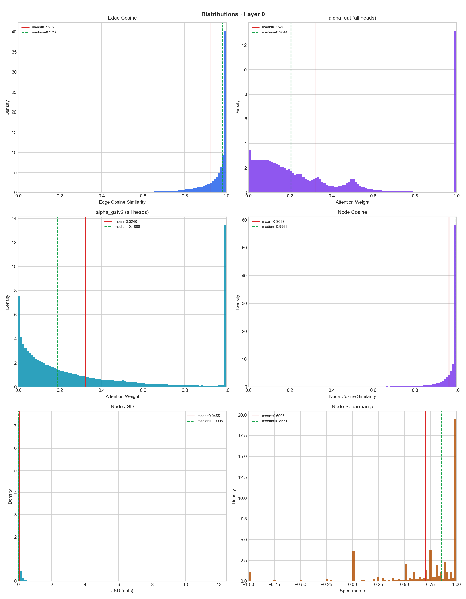
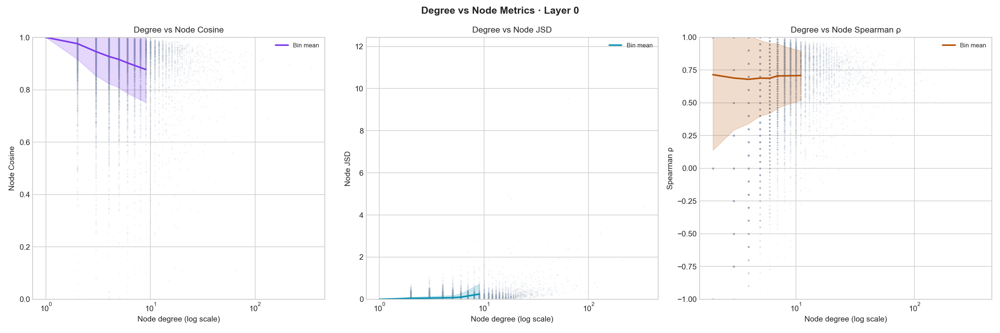
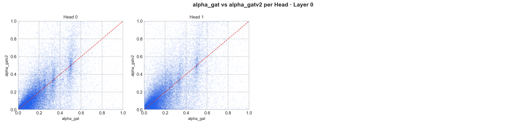
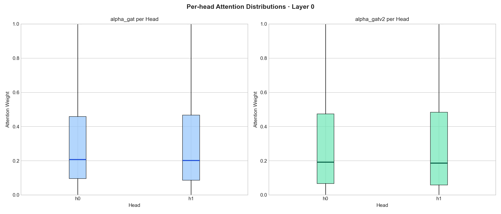
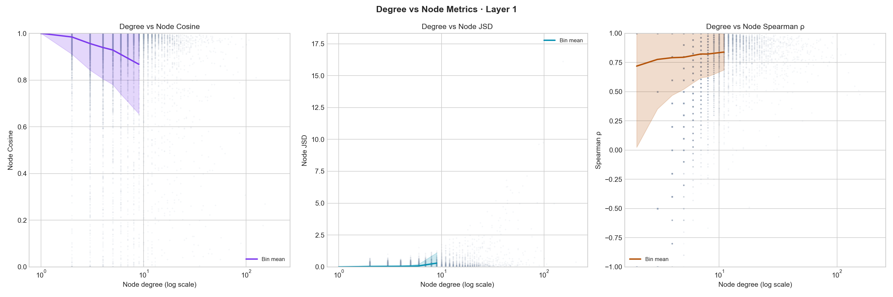
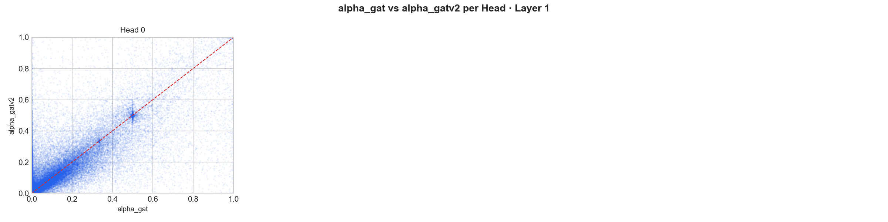
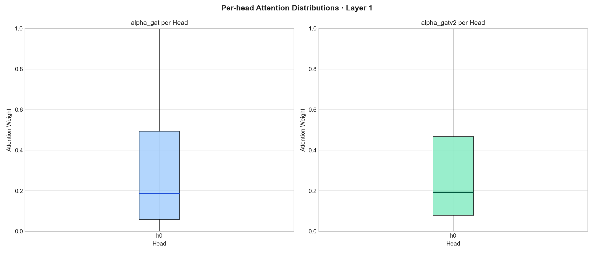

# RQ1 — Do GAT and GATv2 Learn Different Attention Patterns?

**Research Question:** When trained to the same accuracy on the same task, do GAT and GATv2 assign meaningfully different attention scores to the same graph — or do they converge to functionally equivalent routing?

---

## Helper Notebooks

- [Training Helper Notebook (Google Colab)](https://colab.research.google.com/drive/13CBYQn_0Z5pK9tBh_L0xq5VuPWwHyzZO?usp=sharing)
- [Comparison Helper Notebook (Google Colab)](https://colab.research.google.com/drive/1jdWTIekFgjrFR7X_WryQx25vBj3yry7R?usp=sharing)

---

## Pipeline Overview

```
ogbn-arxiv  ──►  Train GAT   ──►  best_gat_arxiv.pt
                 Train GATv2 ──►  best_gatv2_arxiv.pt
                                        │
                                        ▼
              ogbn-products  ──►  compare_attention.py
                                   (100k-node induced subgraph)
                                        │
                          ┌─────────────┴─────────────┐
                     per-edge                      per-node
                   cosine similarity        cosine · JSD · Spearman ρ
                          │                          │
                          └──────────┬───────────────┘
                                     ▼
                          export_attention_csv.py  ──►  attention_comparison_results/attention_tables/
                          summarizer.py            ──►  attention_comparison_results/statistical_summary.txt
                          visualize_results.py     ──►  attention_comparison_results/figures/layer{0,1}/{distributions,degree_vs_node_metrics,head_scatter,head_boxplots}.png
```

### Step-by-step

1. **Train** both models on **ogbn-arxiv** (`train.py --model gat` and `--model gatv2`).  
   The best checkpoint (by validation accuracy) is saved to `checkpoints/`.

2. **Extract attention** on **ogbn-products** (`compare_attention.py`).  
   Models trained on a citation graph are evaluated on a held-out product co-purchase graph to probe whether attention differences persist under domain shift.  
   A 100 000-node induced subgraph is sampled for tractability.  
   Results are saved as `.pt` files in `attention_comparison_results/`.

3. **Export CSVs** (`export_attention_csv.py`).  
   Converts `.pt` tensors to per-edge and per-node CSV tables for downstream analysis.

4. **Summarise** (`summarizer.py`).  
   Computes distributional statistics over all metrics; writes `attention_comparison_results/statistical_summary.txt`.

5. **Visualise** (`visualize_results.py`).  
   Generates histograms, degree-vs-metric scatter plots, per-head scatter plots, and boxplots;  
   saved as PNGs in `attention_comparison_results/figures/layer0/` and `attention_comparison_results/figures/layer1/` (4 files each).

---

## Dataset

### Training — ogbn-arxiv

| Property | Value |
|----------|-------|
| Task | Node classification (40 arXiv subject categories) |
| Nodes | ~169 000 papers |
| Edges | ~1.16 M (made undirected for training) |
| Node features | 128-dim Node2Vec embeddings |
| Source | [Open Graph Benchmark](https://ogb.stanford.edu/docs/nodeprop/#ogbn-arxiv) |

### Comparison — ogbn-products

| Property | Value |
|----------|-------|
| Task | Node classification benchmark; used here for attention extraction only |
| Nodes | ~2.45 M products |
| Edges | ~61.9 M (undirected) |
| Node features | 100-dim bag-of-words → zero-padded to 128 to match model `in_channels` |
| Subgraph | 100 000 randomly sampled nodes (induced); ~208–210k edges |
| Source | [Open Graph Benchmark](https://ogb.stanford.edu/docs/nodeprop/#ogbn-products) |

Using ogbn-products as the evaluation graph introduces a deliberate domain shift: models trained on citation-network embeddings (Node2Vec) are probed on a product co-purchase graph with bag-of-words features. Zero-padding the 100-dim features to 128 leaves 28 trailing zeros, which stresses the attention mechanism differently than the training distribution and may amplify differences between the static (GAT) and dynamic (GATv2) scoring functions.

---

## Model Configuration

Both models are trained under identical hyperparameters for a fair comparison.

| Hyperparameter | Value |
|----------------|-------|
| Layers | 2 |
| Hidden channels | 64 |
| Attention heads | 2 (layer 0), 1 (layer 1 — classification head) |
| Dropout | 0.5 |
| Optimiser | Adam, lr = 0.002 |
| LR schedule | StepLR, step=100, γ=0.5 |
| Epochs | 500 |
| Gradient clipping | max-norm 1.0 |

### Checkpoint performance

| Model | Val accuracy | Best epoch |
|-------|:------------:|:----------:|
| GAT   | 0.6822       | 490        |
| GATv2 | 0.6868       | 500        |

**GAT** uses static attention: `e_ij = a^T [Wh_i ∥ Wh_j]` — the scoring vector sees source and target features independently.  
**GATv2** uses dynamic attention: `e_ij = a^T LeakyReLU(W[h_i ∥ h_j])` — the non-linearity is applied before projection, making the attention function strictly more expressive.

---

## Metrics

Attention weights are compared **layer-by-layer** across both layers of the 2-layer network.  
Layer 0 has 2 heads (intermediate); layer 1 has 1 head (classification).

### Edge-level

| Metric | Description |
|--------|-------------|
| **Edge cosine similarity** | `cos(α_GAT[e,:], α_GATv2[e,:])` across the head dimension for each edge |

### Node-level

| Metric | Description |
|--------|-------------|
| **Node cosine similarity** | For each node `i` and head `h`, cosine similarity between the two models' attention vectors over `N(i)`; averaged over heads |
| **Jensen-Shannon Divergence (JSD)** | `JSD(α_GAT[N(i),h] ∥ α_GATv2[N(i),h])` in natural-log units; theoretical range [0, ln 2 ≈ 0.693]; averaged over heads |
| **Spearman rank correlation (ρ)** | Rank correlation of neighbor orderings between GAT and GATv2; averaged over heads; undefined (NaN) for degree ≤ 1 nodes |

Node-level aggregates are reported as both **uniform means** and **degree-weighted means**. High-degree nodes have more reliable attention estimates and exert greater influence on message passing; the degree-weighted mean is the primary graph-level summary.

---

## Results

### Layer 0 (first message-passing layer)

At layer 0, both models receive the **same input**: 100-dim bag-of-words features zero-padded to 128. Attention differences arise purely from architectural choice — static vs. dynamic scoring.

Subgraph: 100 000 nodes, 308 636 edges, 2 heads

#### Layer 0 — Edge-level

| Metric                 | Mean   | Median | Std    | Frac > 0.9 | Frac < 0.1 |
|------------------------|--------|--------|--------|------------|------------|
| Edge cosine similarity | 0.9252 | 0.9796 | 0.1327 | 77.51%     | 0.32%      |

#### Layer 0 — Node-level

| Metric                 | Unif. mean | Deg-wtd mean | Median | Std    | Frac > 0.9 / Frac > 0.35 |
|------------------------|------------|--------------|--------|--------|--------------------------|
| Node cosine similarity | 0.9639     | 0.9258       | 0.9966 | 0.0816 | 89.68%                   |
| Node JSD (nats)        | 0.0455     | **0.1510**   | 0.0095 | 0.1386 | 1.79% (> 0.35)           |
| Spearman ρ             | 0.6996     | **0.6983**   | 0.8571 | 0.4281 | 44.63% (> 0.9)           |

*Spearman ρ count: 59 718 nodes with degree > 1.*

### Layer 1 (second message-passing layer)

At layer 1, the two models operate on **different hidden representations** — shaped by their divergent layer-0 attention. Despite this, edge-level cosine similarity improves markedly. However, the degree-weighted JSD rises compared to layer 0, revealing that high-degree nodes diverge *more* after representations compound.

Subgraph: 100 000 nodes, 309 834 edges, 1 head

#### Layer 1 — Edge-level

| Metric                 | Mean   | Median | Std    | Frac > 0.9 | Frac < 0.1 |
|------------------------|--------|--------|--------|------------|------------|
| Edge cosine similarity | 0.9846 | 1.0000 | 0.1208 | 98.36%     | 1.40%      |

#### Layer 1 — Node-level

| Metric                 | Unif. mean | Deg-wtd mean | Median | Std    | Frac > 0.9 / Frac > 0.35 |
|------------------------|------------|--------------|--------|--------|--------------------------|
| Node cosine similarity | 0.9684     | **0.9240**   | 0.9997 | 0.1068 | 92.81%                   |
| Node JSD (nats)        | 0.0391     | **0.1922**   | 0.0017 | 0.2050 | 1.84% (> 0.35)           |
| Spearman ρ             | 0.7708     | **0.7949**   | 1.0000 | 0.4849 | 66.77% (> 0.9)           |

*Spearman ρ count: 59 819 nodes with degree > 1.*

---

## Interpretation

### Layer-by-layer dynamics

**Layer 0 — same inputs, meaningful divergence.**  
Both models receive the same zero-padded bag-of-words features. Yet their attention distributions show real disagreement: edge cosine averages only 0.925, and just 44.6% of nodes have Spearman ρ above 0.9. This is consistent with the expressiveness argument in the GATv2 paper — the static scoring function in GAT (`e_ij = a^T [Wh_i ∥ Wh_j]`) cannot model all attention patterns that require a non-linear interaction between source and target features, whereas GATv2's dynamic scoring can. On a co-purchase graph where item relationships may depend on joint feature interactions (e.g. complementary vs. substitute products), this gap is most visible at the first layer where raw features drive the scoring.

**Layer 1 — different inputs, improved vector alignment but worsening distribution divergence for hub nodes.**  
Edge cosine improves substantially to 0.985, and Spearman ρ climbs to 0.771 (66.8% > 0.9). Yet the degree-weighted JSD *increases* from 0.151 to 0.192. These facts are not contradictory: the two models' attention weight *vectors* (head-concatenated) point in similar directions for most edges, but for high-degree product hubs the *distributions* over neighbors become less aligned. Hub nodes aggregate information from many diverse neighbors; small architectural differences in how attention is scored compound across a large neighbourhood, producing divergent probability masses even when the mean cosine is high.

### The degree-weighting signal

A consistent and striking pattern across both layers is the **gap between uniform and degree-weighted means**:

| Layer | Metric      | Uniform mean | Deg-wtd mean |
|-------|-------------|--------------|--------------|
| 0     | Node cosine | 0.964        | 0.926        |
| 0     | Node JSD    | 0.045        | 0.151        |
| 1     | Node cosine | 0.968        | 0.924        |
| 1     | Node JSD    | 0.039        | 0.192        |

High-degree nodes — the hubs that dominate message passing — experience 3–5× greater attention divergence than the average node. Since these hubs disproportionately influence representation learning, the functional difference between GAT and GATv2 may be larger than the uniform statistics suggest.

### Domain shift amplifies architectural differences

The models were trained on ogbn-arxiv (Node2Vec embeddings, citation graph structure) and evaluated on ogbn-products (bag-of-words features, co-purchase graph structure). The 28 zero-padded feature dimensions interact differently with the learned weight matrices of each model, and the co-purchase graph's dense hub-and-spoke topology provides a richer stress test for neighbor-ranking consistency. Compared to citation networks, co-purchase graphs tend to have higher-degree hubs (popular product categories), which is consistent with the observed degree-weighting signal.

### Overall assessment

At a coarse level, GAT and GATv2 are broadly aligned: the median edge cosine is 0.98 at layer 0 and 1.00 at layer 1, and fewer than 2% of nodes have JSD above the half-of-ln(2) threshold. However, the Spearman ρ tells a different story — neighbor orderings are far from interchangeable, particularly at layer 0 (only 44.6% of nodes agree on rankings). And among the high-degree hubs that matter most for message passing, attention distributions diverge substantially. The practical question — whether these differences in attention routing translate to downstream accuracy gaps — remains open and is the subject of RQ2.

---

## File Reference

| File | Role |
|------|------|
| `models.py` | GAT and GATv2 model definitions |
| `train.py` | Training loop for ogbn-arxiv |
| `compare_attention.py` | Attention extraction and metric computation (ogbn-products) |
| `export_attention_csv.py` | Converts `.pt` results to CSV |
| `summarizer.py` | Statistical summary over CSV tables |
| `visualize_results.py` | PNG figure generation (4 plots per layer into `figures/layer{0,1}/`) |
| `commands.txt` | Reference CLI commands for training and attention comparison runs |

---

## Figures

> Embedded as base64 PNG — renders in VS Code preview and local markdown viewers.

### Layer 0 Visualisations

**Distribution histograms (edge cosine, node cosine, JSD, Spearman rho)**



**Degree vs. metric scatter plots**



**Per-head attention scatter plots**



**Node-level metric boxplots**



### Layer 1 Visualisations

**Distribution histograms (edge cosine, node cosine, JSD, Spearman rho)**


**Degree vs. metric scatter plots**



**Per-head attention scatter plots**



**Node-level metric boxplots**



---
