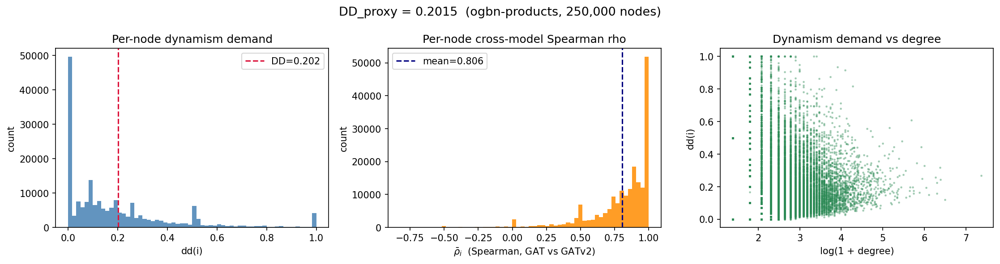

# RQ1 — Dynamism Demand: Formulation and Computation

**Research Question:** How much does the graph structure *demand* dynamic attention — i.e., do GAT and GATv2 route information differently, and can that divergence be quantified as a graph-level scalar?

This document covers the **DD_proxy formulation** and its **end-to-end computation pipeline** on ogbn-products.  
For the raw attention-comparison metrics (cosine, JSD, Spearman) that motivate this formulation, see [RQ1_AttentionComparison.md](RQ1_AttentionComparison.md).  
For the full mathematical specification (including DD_true and the 2×2 interpretation table), see [DD_formula.md](DD_formula.md).

---

## Helper Notebook

- [Computation Helper Notebook (Google Colab)](https://colab.research.google.com/drive/1qoLPJ0kIVT5IlzDMrU_VXJAgPuZIBmSE?usp=sharing)

---

## Pipeline Overview

```
ogbn-arxiv  ──►  best_gat_arxiv.pt
                 best_gatv2_arxiv.pt
                        │
                        ▼
         ogbn-products  ──►  compute_dd.py
                              (250k-node induced subgraph, zero-padded to 128-dim)
                                     │
                      ┌──────────────┴──────────────┐
                 dd_products.pt                dd_products.png
              (per-node tensors)             (3-panel diagnostic plot)
                      │
                      ▼
               summarize_dd.py
                      │
          ┌───────────┴───────────┐
    dd_summary.txt           dd_nodes.csv
   (human-readable           (per-node table:
    statistical report)       node_id, degree,
                               rho_bar, dd)
```

### Step-by-step

1. **Train** both models on **ogbn-arxiv** (`train.py --model gat` and `--model gatv2`).  
   The best checkpoint (by validation accuracy) is saved to `checkpoints/`.

2. **Compute DD_proxy** on **ogbn-products** (`compute_dd.py`).  
   Both frozen models are run in a single forward pass on the same induced subgraph (fixed seed=42).  
   ogbn-products has 100-dim features; these are zero-padded to 128 so frozen weights apply without retraining.  
   Per-node Spearman correlations are accumulated across layers and heads, then aggregated into a single graph-level scalar.  
   Results are saved as a `.pt` tensor bundle in `dd_results/`.

3. **Summarise** (`summarize_dd.py`).  
   Parses `dd_products.pt` and writes a structured text report and a per-node CSV.

---

## Formula — DD_proxy(G)

The full derivation is in [DD_formula.md](DD_formula.md). The key steps:

**Step 1 — Per-node, per-layer, per-head Spearman correlation**

For each node $i$ with $\deg(i) \geq 3$, layer $l$, and head $h$:

$$\rho_i^{(l,h)} = \text{Spearman}\!\left(\alpha_{\text{GAT}}^{(l,h)}[N(i)],\; \alpha_{\text{GATv2}}^{(l,h)}[N(i)]\right)$$

Nodes with $\deg(i) \leq 2$ are excluded because rank correlations over fewer than four values are statistically brittle (only $\pm 1$ or $0$ are achievable). With self-loops added by GATConv, `min_deg=3` corresponds to $\geq 2$ real neighbours.

**Step 2 — Head-weighted aggregation across layers**

$$\bar{\rho}_i = \frac{\displaystyle\sum_{l}\sum_{h} \rho_i^{(l,h)}}{\displaystyle\sum_{l} H_l}$$

For the 2-layer model ($H_0 = 2$, $H_1 = 1$, total 3 head-slots):

$$\bar{\rho}_i = \frac{\rho_i^{(0,1)} + \rho_i^{(0,2)} + \rho_i^{(1,1)}}{3}$$

**Step 3 — Per-node dynamism demand**

$$\text{dd}(i) = 1 - \max\!\left(0,\; \bar{\rho}_i\right) \;\in\; [0, 1]$$

Anticorrelated rankings ($\bar\rho_i < 0$) are clamped to the same demand level as zero correlation.

**Step 4 — Graph-level DD (degree-weighted mean)**

$$\boxed{DD_{\text{proxy}}(G) = \frac{\displaystyle\sum_{\substack{i \in V \\ \deg(i)\,\geq\,3}} \deg(i)\cdot \text{dd}(i)}{\displaystyle\sum_{\substack{i \in V \\ \deg(i)\,\geq\,3}} \deg(i)}}$$

High-degree nodes receive greater weight because they have more reliable Spearman estimates and greater influence on message passing.

---

## Dataset

### Training — ogbn-arxiv

| Property | Value |
|----------|-------|
| Task | Node classification (40 arXiv subject categories) |
| Nodes | ~169 000 papers |
| Edges | ~1.16 M (made undirected for training) |
| Node features | 128-dim Node2Vec embeddings |
| Source | [Open Graph Benchmark](https://ogb.stanford.edu/docs/nodeprop/#ogbn-arxiv) |

### Evaluation — ogbn-products

| Property | Value |
|----------|-------|
| Task | Node classification (Amazon co-purchase graph; labels unused here) |
| Nodes | ~2.45 M products |
| Edges | ~61.9 M (made undirected) |
| Node features | 100-dim bag-of-words → **zero-padded to 128** for frozen model compatibility |
| Subgraph | 250 000 randomly sampled nodes (induced, seed=42) |
| Induced edges | ~2 578 744 (undirected, before self-loops) |
| Source | [Open Graph Benchmark](https://ogb.stanford.edu/docs/nodeprop/#ogbn-products) |

Using ogbn-products as the evaluation graph tests whether the DD_proxy signal is informative on a structurally different graph (co-purchase network vs. citation network). Features are zero-padded rather than reprojected, keeping the frozen weights valid and making the comparison purely structural.

---

## Model Configuration

Both models are the same checkpoints trained for RQ1 (see [RQ1_AttentionComparison.md](RQ1_AttentionComparison.md)).

| Hyperparameter | Value |
|----------------|-------|
| Layers | 2 |
| Hidden channels | 64 |
| Attention heads | 2 (layer 0), 1 (layer 1) |
| Dropout | 0.0 (eval mode) |
| GAT val accuracy | 0.6822 (ogbn-arxiv) |
| GATv2 val accuracy | 0.6868 (ogbn-arxiv) |

The two models differ by < 0.005 in validation accuracy — a prerequisite for a fair DD_proxy comparison, since a model that has not converged may diverge from the other for reasons unrelated to expressiveness.

---

## Implementation Notes (`compute_dd.py`)

### Single forward pass

Both models are run **in a single call** on the same subgraph object. This is critical: `compare_attention.py` (RQ1) runs per-layer separately and can produce misaligned node orderings if the subgraph changes between calls. `compute_dd.py` avoids this entirely.

### Spearman via Pearson-on-ranks

Spearman correlation is computed as Pearson correlation of integer ranks, fully vectorised on GPU:

```
_rank_within_group   — argsort-based 0-indexed rank per source-node group  [E]
_pearson_within_group — Pearson(ra, rb) per group using scatter reductions  [N]
per_node_spearman    — loops over heads, stacks, averages                   [N]
```

This avoids Python loops over nodes and keeps the entire computation on-device until the final `cpu()` transfer.

### Head-weighted accumulation

```python
weighted_rho += H_l * rho_l.nan_to_num(0.0)
total_heads  += H_l
rho_bar = weighted_rho / total_heads   # = (2*rho_L0 + 1*rho_L1) / 3
```

`NaN` entries (degree-filtered nodes) are treated as 0 during accumulation and re-masked to `NaN` afterwards, preserving the exclusion.

### Zero-padding

ogbn-products provides 100-dim features. The loader detects `x.size(1) < 128` and appends zeros:

```python
x = torch.cat([x, torch.zeros(x.size(0), 128 - x.size(1))], dim=1)
```

Both models see identical padded features, so the relative comparison remains valid.

---

## File Reference

| File | Role |
|------|------|
| `models.py` | GAT and GATv2 model definitions (returns attention weights per layer) |
| `checkpoints/best_gat_arxiv.pt` | Frozen GAT checkpoint trained on ogbn-arxiv |
| `checkpoints/best_gatv2_arxiv.pt` | Frozen GATv2 checkpoint trained on ogbn-arxiv |
| `compute_dd.py` | Main DD_proxy computation; outputs `.pt` tensor bundle and optional PNG |
| `summarize_dd.py` | Parses `.pt` output; writes `dd_summary.txt` and `dd_nodes.csv` |
| `DD_formula.md` | Full mathematical specification of DD_proxy and DD_true |

### Files generated

| File | Description |
|------|-------------|
| `dd_results/dd_products.pt` | Tensor bundle: `DD_proxy` (scalar), `dd_per_node` [N], `rho_bar` [N], `deg` [N], metadata |
| `dd_results/dd_products.png` | 3-panel diagnostic: dd histogram, rho_bar histogram, dd vs log-degree scatter |
| `dd_results/dd_summary.txt` | Human-readable statistical report (degree-stratified, hub spotlight) |
| `dd_results/dd_nodes.csv` | Per-node table: `node_id`, `degree`, `rho_bar`, `dd` |
| `logs/compute_dd.log` | Runtime log: device, checkpoint accuracy, per-layer rho stats, final scalar |

---

## Results

### Per-layer Spearman statistics (from `logs/compute_dd.log`)

Both models were evaluated on a Tesla T4 (15.6 GB VRAM).

| Layer | Heads | Mean ρ | Median ρ | Std ρ |
|-------|-------|--------|----------|-------|
| 0 | 2 | 0.7801 | 0.8619 | 0.2798 |
| 1 | 1 | 0.8575 | 0.9670 | 0.2809 |

Layer 1 shows **higher and more concentrated agreement** than layer 0 — consistent with the RQ1 finding that architectural differences matter most early in the network where both models operate on the same raw features.

### Graph-level DD_proxy

| Metric | Value |
|--------|-------|
| Valid nodes (deg ≥ 3) | 190 931 (76.4% of 250 000 sampled) |
| $\bar\rho$ mean | 0.8059 |
| $\bar\rho$ median | 0.8791 |
| **DD_proxy(G)** | **0.2015** |
| Demand level | **low (< 0.33)** |

### DD(i) distribution

| Statistic | dd(i) | rho_bar |
|-----------|-------|---------|
| Mean | 0.1917 | 0.8059 |
| Std | 0.2211 | 0.2318 |
| Min | 0.0000 | −0.8214 |
| p5 | 0.0000 | 0.3667 |
| p25 | 0.0000 | 0.7333 |
| Median | 0.1209 | 0.8791 |
| p75 | 0.2667 | 1.0000 |
| p95 | 0.6333 | 1.0000 |
| Max | 1.0000 | 1.0000 |

### Demand level breakdown

| Level | Range | Fraction | Nodes |
|-------|-------|----------|-------|
| Low | dd < 0.33 | 80.78% | 154 226 |
| Moderate | 0.33 ≤ dd < 0.66 | 14.52% | 27 714 |
| High | dd ≥ 0.66 | 4.71% | 8 991 |

The overwhelming majority of nodes (80.8%) have low dynamism demand, and the degree-weighted graph-level scalar reinforces this: $DD_{\text{proxy}} = 0.20$.

### Degree-stratified DD_proxy

| Degree band | Nodes | Mean dd | Median dd | Mean degree |
|-------------|-------|---------|-----------|-------------|
| low (3–5) | 66 705 | 0.1630 | 0.0000 | 3.8 |
| medium (6–20) | 86 085 | 0.2120 | 0.1545 | 11.5 |
| high (21–100) | 36 603 | 0.1950 | 0.1589 | 34.2 |
| hub (> 100) | 1 538 | 0.2237 | 0.2051 | 175.5 |

DD is **uniformly low across all degree bands**. Hub nodes (> 100 neighbours) have the highest mean dd (0.2237), but this is still firmly in the low regime. The co-purchase graph does not generate structural pressure for dynamic attention on this benchmark.

### Top-10 highest-degree hubs

| node_id | degree | rho_bar | dd(i) |
|---------|--------|---------|-------|
| 95 238 | 1 577 | 0.7314 | 0.2686 |
| 81 208 | 1 135 | 0.8153 | 0.1847 |
| 138 427 | 1 019 | 0.7817 | 0.2183 |
| 132 134 | 1 015 | 0.8066 | 0.1934 |
| 69 549 | 951 | 0.8755 | 0.1245 |
| 26 128 | 905 | 0.8075 | 0.1925 |
| 52 710 | 861 | 0.7876 | 0.2124 |
| 90 786 | 839 | 0.7976 | 0.2024 |
| 27 453 | 805 | 0.8788 | 0.1212 |
| 180 296 | 791 | 0.6969 | 0.3031 |

Even the most heavily connected node (degree 1 577) has $dd = 0.27$ — GAT and GATv2 agree on its neighbour rankings at $\bar\rho = 0.73$. No hub falls into the high-demand regime.

---

## Diagnostic Plots

**3-panel diagnostic (dd histogram, rho_bar histogram, dd vs log-degree)**



- **Left:** Per-node dd(i) is sharply right-skewed; the modal bucket is dd = 0 (GAT and GATv2 agree perfectly on ranking). The dashed red line marks DD_proxy = 0.20.
- **Centre:** rho_bar is left-skewed toward 1.0 — most nodes sit at near-perfect agreement. The tail toward negative values corresponds to the 4.7% high-demand nodes.
- **Right:** dd vs log(1 + degree) shows no strong trend; dynamic routing does not concentrate at high degree. The scatter is heterogeneous across all degree levels.

---

## Interpretation

### ogbn-products is a low-dynamism graph

$DD_{\text{proxy}} = 0.20$ places ogbn-products firmly in the **low** demand regime. On this co-purchase graph, GAT and GATv2 assign nearly identical neighbourhood rankings at both layers. Static attention appears sufficient; the architectural advantage of GATv2's dynamic scoring function does not manifest as routing differences on this data.

This is consistent with the structure of co-purchase graphs: products that frequently co-occur tend to cluster by category, and the neighbourhood geometry is largely symmetric — both static and dynamic attention functions converge on the same high-weight neighbours.

### Cross-layer pattern

Layer 1 has higher Spearman agreement (median $\rho = 0.97$) than layer 0 (median $\rho = 0.86$), consistent with the pattern observed in the attention comparison (RQ1) on the same dataset. Dynamic attention differences arise at the feature level (layer 0) but wash out as representations converge under the shared supervised signal.

### Comparison with the attention comparison (RQ1, 100k sample)

The attention comparison (RQ1) used a 100k-node subgraph of ogbn-products and reported Spearman ρ over all nodes with deg > 1: layer 0 uniform mean = 0.700, layer 1 uniform mean = 0.771. The DD computation uses a 250k-node subgraph (seed = 42) and restricts to nodes with deg ≥ 3 (including the self-loop added by GATConv), giving layer 0 mean ρ = 0.780 and layer 1 mean ρ = 0.858. The higher values arise because the deg ≥ 3 filter excludes very-low-degree nodes, which tend to produce more extreme Spearman values and would otherwise dilute the mean. Both analyses agree on the qualitative conclusion: ogbn-products is a low-dynamism graph where GAT and GATv2 agree on neighbourhood rankings at both layers.

### What a high-DD graph would look like

A graph with $DD_{\text{proxy}} > 0.66$ would require that the majority of nodes disagree on their top neighbours depending on who is asking — i.e., the shared neighbourhood geometry must be asymmetric enough that different query nodes genuinely prefer different subsets of common neighbours. Heterophilic graphs (where connected nodes differ in class) or graphs with strong asymmetric edge weights are candidate settings for RQ2.

---

## Infusing Accuracy: DD_proxy + Δacc for Node Classification

DD_proxy is a **structural signal** — it measures how differently GAT and GATv2 route information, using attention weights alone and requiring no labels. Classification accuracy is a **functional signal** — it measures whether those routing differences translate into downstream gains. The two signals answer orthogonal questions and should always be interpreted together.

### Defining Δacc for node property prediction

For any node classification benchmark:

$$\Delta\text{acc} = \text{acc}(\text{GATv2}) - \text{acc}(\text{GAT})$$

where accuracy is measured on the **same train/val/test split** under identical hyperparameters. Both models should be trained independently until convergence (or to the same epoch budget with the same LR schedule). A positive $\Delta\text{acc}$ means GATv2 is the better classifier on this graph; a value near zero means the models are functionally equivalent despite any architectural differences.

For ogbn-products specifically, the evaluation metric is **test accuracy** (fraction of nodes with correctly predicted product category out of 47 classes). The degree-weighted nature of the graph — hubs have thousands of neighbours — makes the node classification task sensitive to how attention aggregates neighbourhood signals, making Δacc a meaningful proxy for whether dynamic routing matters.

### The 2×2 interpretation table

| $DD_{\text{proxy}}$ | $\Delta\text{acc}$ | Interpretation |
|---|---|---|
| Low (< 0.33) | $\approx 0$ | Static attention suffices. GATv2 adds no value. Expected and self-consistent outcome. |
| Low (< 0.33) | High (> 0) | GATv2 gains accuracy without dynamic routing — likely better regularisation or capacity, not dynamism. Weakens the claim that DD_proxy specifically measures expressiveness. |
| High (> 0.66) | High (> 0) | Dynamic attention is genuinely needed and delivers gains. GATv2 is the right choice. |
| High (> 0.66) | $\approx 0$ | GATv2 routes differently but gains nothing — possible overfitting, task insensitivity, or label noise. |

### Applying this to ogbn-products

$DD_{\text{proxy}} = 0.20$ (low). The 2×2 table predicts that GATv2 should deliver **no meaningful accuracy gain** over GAT on this co-purchase graph. This is a falsifiable, a-priori prediction: if we train both models on ogbn-products and observe $\Delta\text{acc} \approx 0$, it validates DD_proxy as a meaningful structural signal. If instead GATv2 outperforms significantly, it would suggest the gain comes from capacity or regularisation effects unrelated to dynamic routing — a finding that would need to be noted as a limitation of the proxy.

The checkpoint accuracies on ogbn-arxiv (GAT: 0.6822, GATv2: 0.6868, $\Delta\text{acc} = 0.0046$) already show a small but non-zero gap on the training graph. On ogbn-products, the structural signal predicts this gap should shrink further or vanish entirely. Verifying this constitutes a **within-RQ1 sanity check** before moving to the cross-graph analysis in RQ2.

### Demand level thresholds

| $DD_{\text{proxy}}$ range | Label | Predicted Δacc |
|---|---|---|
| $[0,\ 0.33)$ | Low | $\approx 0$ — static attention suffices |
| $[0.33,\ 0.66)$ | Moderate | Small positive — check Δacc empirically |
| $[0.66,\ 1]$ | High | Positive — GATv2 likely the better choice |

These thresholds are provisional. The RQ2 cross-graph analysis will calibrate data-driven boundaries by regressing $\Delta\text{acc}$ on $DD_{\text{proxy}}$ across multiple benchmark graphs.

---

## Roadmap to RQ2 and RQ3

### RQ2 — Does DD_proxy predict Δacc across graphs?

RQ2 asks whether $DD_{\text{proxy}}$ is predictive of when GATv2 outperforms GAT, not just descriptive of their routing differences. The protocol:

```text
For each benchmark graph G_k  (k = 1 … K):
  ├── Compute DD_proxy(G_k)   (structural signal, no labels needed)
  └── Train GAT and GATv2 on G_k, record Δacc_k  (functional signal)
              ↓
Compute Pearson r between  {DD_proxy(G_k)}  and  {Δacc_k}
```

A high correlation ($r > 0.7$, say) would validate that DD_proxy is not just measuring architectural noise but is genuinely predictive of task performance. ogbn-products ($DD_{\text{proxy}} = 0.20$) contributes one low-DD / expected-low-Δacc data point to this regression. The analysis requires at least 5–6 graphs spanning the full DD range to be statistically meaningful.

**What the current result contributes to RQ2:**  
ogbn-products provides the anchor at the low end of the DD spectrum. If its Δacc is indeed near zero, it strengthens the regression. If DD_proxy turns out to be uniformly low across all tested graphs, it would indicate the benchmark suite does not span enough structural variation and new, more heterophilic graphs should be added.

**Cross-graph transfer caveat:**  
When frozen weights trained on $G_1$ (ogbn-arxiv) are used to compute DD_proxy on $G_2$ (ogbn-products), the attention distributions remain meaningful only if the two graphs are structurally similar enough for the learned representations to transfer. Both are citation/co-purchase graphs with 128-dim node features, so transfer is reasonable. For heterogeneous benchmark suites, DD_proxy should be computed from models trained directly on each target graph — otherwise, DD_proxy may reflect the source graph's structure rather than the target's.

### RQ3 — Graph-level DD as a model selection rule

RQ3 operationalises the RQ2 findings into a practical decision rule:

```text
Given a new graph G:
  1. Train (or load frozen) GAT and GATv2
  2. Compute DD_proxy(G)   ← structural signal, O(|E|) per layer
  3. If DD_proxy < τ_low  → use GAT  (or a simpler non-attention model)
     If DD_proxy > τ_high → use GATv2
     Otherwise            → run both and select on val accuracy
```

The thresholds $\tau_{\text{low}}$ and $\tau_{\text{high}}$ are calibrated from the RQ2 regression. The current provisional values ($0.33$ and $0.66$) will be replaced by the empirically derived cut-points where $\Delta\text{acc}$ transitions from negligible to practically significant.

**DD_true as a validation layer:**  
DD_true (computed from GATv2 attention alone, across pairs sharing common neighbours) can serve as a model-agnostic check in RQ3. If a graph has high $DD_{\text{proxy}}$ but low $DD_{\text{true}}$, the divergence between GAT and GATv2 may be artefactual (e.g., GAT failed to converge) rather than a genuine signal of structural demand. High $DD_{\text{true}}$ confirms that GATv2 is actually computing query-dependent attention, not just random noise. The validation protocol (Pearson $r$ between $DD_{\text{true}}$ and $DD_{\text{proxy}}$ on five induced subgraphs, target $r > 0.85$) is specified in [DD_formula.md §3](DD_formula.md).

**What ogbn-products tells RQ3:**  
The low-DD result here provides evidence that co-purchase graphs are natural candidates for the "use GAT" branch of the decision rule. A practitioner working on a new Amazon-style co-purchase graph could compute $DD_{\text{proxy}}$ and, if it falls below $\tau_{\text{low}}$, skip the more expensive GATv2 training entirely.

---
